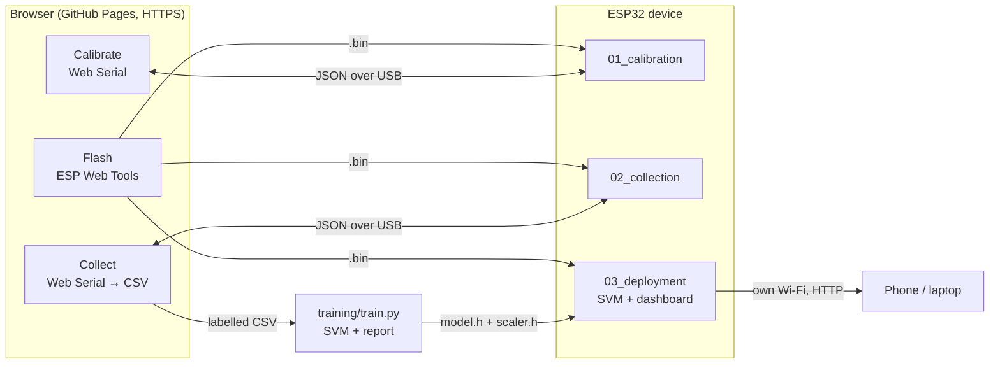
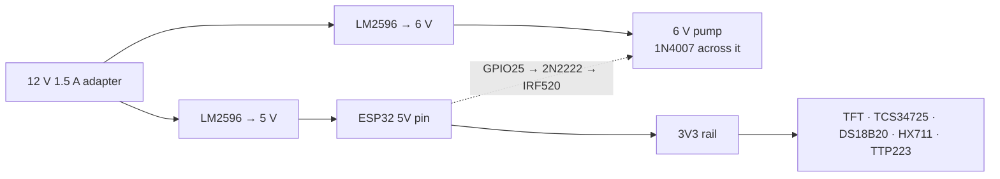

# Aqua Milk Detect

**Milk purity in seconds.**

A low-cost, portable IoT + edge-ML device that classifies a milk sample as **Pure**,
**Water-adulterated**, **Detergent-adulterated** or **Starch-adulterated** — or honestly
says **Uncertain** — in a few seconds, using six sensors and an on-device SVM. It flushes
its own chamber between tests, shows the verdict on a TFT, and serves its own Wi-Fi
dashboard with no internet involved.

[](https://github.com/nikk-0712/aquamilk-detect/actions/workflows/build-and-deploy.yml)
[](https://nikk-0712.github.io/aquamilk-detect/)
[](LICENSE)

SDGs: 3 (Good Health), 9 (Industry & Innovation), 12 (Responsible Consumption).

---

## How the whole thing fits together



Four stages, in order:

| Stage | You do | Where |
|---|---|---|
| 1 · Calibrate | Zero and span every sensor; constants are saved in the ESP32's NVS | [01_calibration](01_calibration/) |
| 2 · Collect | Capture labelled pure/spiked samples; the browser writes the CSV | [02_collection](02_collection/) |
| 3 · Train | Fit the SVM, read the honest report, export two headers | [training](training/) |
| 4 · Deploy | Flash the finished tester; it runs standalone | [03_deployment](03_deployment/) |

The web app that drives stages 1, 2 and the flashing lives in [web/](web/) and is
published to GitHub Pages by CI. Shared sensor code lives once in
[libs/AquaMilkSensors](libs/AquaMilkSensors) — all three firmwares compile the same file.

---

## Hardware

ESP32 DevKit V1 (38-pin, ESP32-WROOM-32), Arduino core — not ESP-IDF.

| Function | Part | Interface |
|---|---|---|
| pH | Analog pH kit, BNC probe | analog → ADC1 |
| TDS / conductivity | DFRobot Gravity Analog TDS | analog → ADC1 |
| Turbidity | Turbidity sensor + module | analog → ADC1 |
| Colour | TCS34725 RGB + Clear | I²C |
| Temperature | DS18B20 waterproof | OneWire |
| Density | HX711 + 3 kg load cell | 2-wire |
| Display | 1.8" ST7735 TFT, 128×160 | SPI |
| Pump | 6 V peristaltic dosing pump | via IRF520 module |
| Input | 1 × TTP223 capacitive pad | GPIO (RTC pin) |
| Power | 12 V 1.5 A adapter + LM2596 buck ×2 | — |

### Pin map (final — used by all three firmwares)

Defined once in [`libs/AquaMilkSensors/src/pins.h`](libs/AquaMilkSensors/src/pins.h).

| Signal | GPIO | Notes |
|---|---|---|
| pH analog in | **36** | VP, ADC1_CH0, input-only |
| TDS analog in | **39** | VN, ADC1_CH3, input-only |
| Turbidity analog in | **34** | ADC1_CH6, input-only |
| TCS34725 SDA / SCL | **21 / 22** | I²C |
| DS18B20 data | **4** | 4.7 kΩ pull-up to 3V3 |
| HX711 DOUT / SCK | **16 / 17** | |
| TFT SCLK / MOSI | **18 / 23** | VSPI |
| TFT CS / DC / RST | **5 / 2 / 15** | strapping pins, fine as outputs |
| TFT backlight | 3V3 | (GPIO32 left free for PWM dimming) |
| Pump gate (IRF520 SIG) | **25** | LEDC PWM |
| TTP223 OUT | **27** | RTC-capable → deep-sleep touch wake |

Free for later: 13, 14, 26, 32, 33, 35 (35 input-only). Avoid GPIO12 (boot strapping).

### Two wiring things that will bite you

**1 · The analog sensors can exceed 3.3 V.** The ESP32's ADC tops out at ~3.3 V, but the
turbidity module swings to 4.5 V and the pH board can approach 5 V. Put a **resistor
divider** (2:1 is fine, e.g. two 10 kΩ) on those channels, or run the boards from 3.3 V.
Then tell the firmware the ratio you actually built — `div_ph`, `div_turb`, `div_tds` on
the Calibrate page — because everything downstream reports millivolts *at the sensor*.
All three analog channels are on **ADC1** deliberately: ADC2 does not work while Wi-Fi is
on, and stage 3 needs Wi-Fi.

**2 · The IRF520 is not a logic-level MOSFET.** Its gate wants ~10 V; at the ESP32's
3.3 V it barely conducts — weak flow, hot FET, unreliable. Drive it through a 2N2222:

```
GPIO25 ──1kΩ──┤ base    2N2222     collector ──┬── IRF520 SIG
              │ emitter ── GND                 └── 10kΩ ── +5V
```

That transistor **inverts** the signal, so GPIO HIGH = pump OFF. Hence
`PUMP_ACTIVE_LOW` defaults to `true` in
[`sensors.h`](libs/AquaMilkSensors/src/sensors.h). Swapping in a logic-level MOSFET
(IRLZ44N) driven directly? Set that flag `false` and rebuild. And always fit the
**1N4007 flyback diode across the pump**, band to +6 V.

### Power



Full connection-by-connection list and the power budget: [docs/wiring.md](docs/wiring.md).

---

## Use it

### Flash

Easiest path: open the Pages site in **desktop Chrome or Edge** → **Flash** → pick a
firmware. That is why CI exists; the `.bin` files are published next to the site. You
never tell the page a COM port — Chrome shows its own serial-device picker when you click
Install, and you choose your board there (`USB-SERIAL CH340 (COM7)` or similar). If the
board is not in that list it is a driver or cable problem: install the CH340/CP2102
driver and use a data-capable cable, not a charge-only one.

From a clone instead. Find your port first — **`COM5` below is only an example**:

```bash
arduino-cli board list
```

```bash
arduino-cli compile --fqbn esp32:esp32:esp32:PartitionScheme=huge_app --libraries libs 01_calibration
```

```bash
arduino-cli upload -p COM5 --fqbn esp32:esp32:esp32:PartitionScheme=huge_app 01_calibration
```

`--libraries libs` is what resolves `#include <sensors.h>`. Using the Arduino IDE? Copy
`libs/AquaMilkSensors` into your `Arduino/libraries/` folder once. Library and core
versions are pinned in
[`build-firmware.yml`](.github/workflows/build-firmware.yml).

### Calibrate, then collect

Walkthroughs live with the firmware: [stage 1](01_calibration/README.md),
[stage 2](02_collection/README.md). Order matters — the collection firmware reads the
constants stage 1 stored, and the model is only as good as the calibration underneath it.

### Train

```bash
python -m pip install -r training/requirements.txt
```

```bash
python training/train.py
```

Reads `training/data/*.csv`, prints accuracy, macro-F1, per-class precision/recall, the
full confusion matrix, a threshold sweep and a limitations section, then writes `model.h`
and `scaler.h`. Copy both into `03_deployment/` and reflash. Details and the honest
reading of those numbers: [training/README.md](training/README.md).

Want to see the pipeline run before you own any data? `python training/train.py --synthetic`.

### Run the finished device

Power it. It brings up its own Wi-Fi — **AquaMilk-XXXX**, password shown on the TFT — and
serves the dashboard at **http://192.168.4.1**. Point it at your own network in Settings
and it also answers at `http://aquamilk.local`. No phone needed for a test, though:

| Gesture on the pad | Action |
|---|---|
| Single tap | Run a test |
| Double tap | Flush now |
| Long press ~1.5 s | On-screen menu (tap = next, double tap = select, long press = exit) |
| Tap, tap, hold | Sleep. A touch wakes it |

A test averages ~3 s, shows the class with a confidence ring, gives the binary
pure-vs-adulterated headline plus the two sensors that drove the decision, logs the
result, then flushes for ~5 s. Below the confidence threshold (default 0.60, adjustable)
it reports **Uncertain** rather than guessing.

---

## Repo layout

```
aquamilk-detect/
├── PROJECT_CONTEXT.md      the spec; it wins any disagreement with this README
├── 01_calibration/         stage 1 sketch + walkthrough
├── 02_collection/          stage 2 sketch + capture workflow
├── 03_deployment/          stage 3 sketch, SVM inference, dashboard, model headers
├── libs/AquaMilkSensors/   shared sensors, calibration, pump, display, feature contract
├── web/                    the GitHub Pages app (+ firmware/ filled by CI)
├── training/               SVM trainer, notebook, report
├── tools/                  build_dashboard.py (gzips the device dashboard into PROGMEM)
├── docs/                   wiring detail, original build prompts
└── .github/workflows/      build firmware · deploy Pages
```

## CI

One workflow, [`build-and-deploy.yml`](.github/workflows/build-and-deploy.yml): regenerate
`03_deployment/dashboard.h` (failing if the committed copy was stale), compile all three
sketches with pinned tool/core/library versions, stage the merged `.bin`s and ESP Web
Tools manifests into `web/firmware/`, then publish `web/` to Pages. It fails loudly if any
sketch does not compile, and the job summary warns when the deployment build still carries
the placeholder model.

The binaries are **not committed** — they reach Pages as an artifact. arduino-cli pads a
merged image to the full 4 MB flash size, so committing three of them added ~12 MB to git
on every run; going via the artifact also means CI needs no write access to the repo and
leaves no bot commits. The trade-off: a plain `git clone` gives you no prebuilt binaries,
so build them yourself or grab them from the live site.

Live at **https://nikk-0712.github.io/aquamilk-detect/**. Pages is set to Source:
GitHub Actions.

## Honest limits

- `03_deployment/model.h` ships as a **placeholder**. Until you train, every test
  correctly reports "Uncertain — no model on device".
- The model learns raw sensor millivolts from *your* device with *your* calibration.
  Recalibrating, swapping a probe or moving to another board shifts those numbers.
- Starch is the hardest class — it pushes turbidity the same direction fat does.
- Specific gravity comes from grams in a fixed-volume chamber, with an approximate
  thermal-expansion correction. The constants are tunable in `sensors.cpp` and
  `training/utils.py`; they are one place real hardware will need tuning.
- This is a screening instrument, not a laboratory assay. It tells you a sample looks
  wrong and deserves a real test.

MIT licensed.
