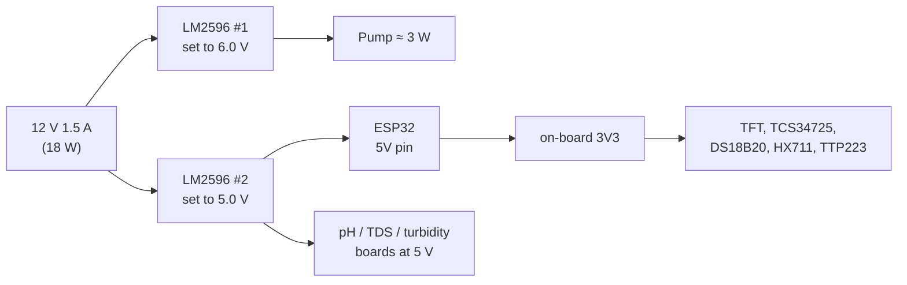

# Wiring

Every connection, plus the two places this build differs from the naive one. Pin
assignments are authoritative in
[`libs/AquaMilkSensors/src/pins.h`](../libs/AquaMilkSensors/src/pins.h) and
`PROJECT_CONTEXT.md` §3.

## Signal map

flowchart TB
  subgraph esp["ESP32-WROOM-32 DevKit V1"]
    direction LR
    A36["GPIO36 ADC1_CH0"]:::in
    A39["GPIO39 ADC1_CH3"]:::in
    A34["GPIO34 ADC1_CH6"]:::in
    I2C["GPIO21/22 I²C"]
    OW["GPIO4 OneWire"]
    HX["GPIO16/17"]
    SPI["GPIO18/23 + 5/2/15"]
    PWM["GPIO25 PWM"]
    TCH["GPIO27 RTC"]
  end

  PH["pH board<br/>0–5 V out"] -->|2:1 divider| A36
  TDS["Gravity TDS<br/>0–2.3 V out"] --> A39
  TURB["Turbidity module<br/>0–4.5 V out"] -->|2:1 divider| A34
  COL["TCS34725"] --- I2C
  DS["DS18B20<br/>4.7 kΩ to 3V3"] --- OW
  LC["HX711 + 3 kg cell"] --- HX
  TFT["ST7735 128×160"] --- SPI
  PWM --> Q["2N2222 level shifter"] --> M["IRF520 module"] --> P["6 V pump"]
  PAD["TTP223 pad"] --> TCH

  classDef in fill:#0FB5C9,color:#fff,stroke:none;

## Connection list

### Analog (all on ADC1 — ADC2 is dead while Wi-Fi runs)

| From | To | Notes |
|---|---|---|
| pH board signal | divider → GPIO36 | Board output can approach 5 V. **Divider required.** |
| pH board VCC / GND | 5 V / GND | Common ground with the ESP32 or readings wander |
| TDS signal | GPIO39 | Output stays under 2.4 V, so a divider is optional (`div_tds = 1.0`) |
| TDS VCC / GND | 5 V / GND | |
| Turbidity signal | divider → GPIO34 | 0–4.5 V output. **Divider required.** |
| Turbidity VCC / GND | 5 V / GND | |

A 2:1 divider is two equal resistors (10 kΩ + 10 kΩ) from signal to ground, tapped in the
middle. Measure what you actually built and enter the ratio on the Calibrate page — the
firmware multiplies the pin voltage by it, so a wrong ratio silently scales every reading
and therefore every feature the model sees.

GPIO36/39/34 are **input-only** pins. That is fine here and is why they were chosen.

### Digital

| From | To | Notes |
|---|---|---|
| TCS34725 SDA / SCL | GPIO21 / GPIO22 | 3V3 power. Most breakouts have pull-ups fitted |
| DS18B20 data | GPIO4 | **4.7 kΩ pull-up from data to 3V3** — without it, -127 °C |
| DS18B20 VCC / GND | 3V3 / GND | |
| HX711 DT / SCK | GPIO16 / GPIO17 | 3V3 or 5 V both work; 3V3 is quieter |
| Load cell → HX711 | E+ E- A+ A- | Colour order per your cell's datasheet |
| TFT SCLK / MOSI | GPIO18 / GPIO23 | VSPI |
| TFT CS / DC / RST | GPIO5 / GPIO2 / GPIO15 | Strapping pins, safe as outputs |
| TFT LED / BL | 3V3 | Move to GPIO32 if you want PWM dimming |
| TTP223 OUT | GPIO27 | Active high. RTC-capable, so ext0 deep-sleep wake works |
| TTP223 VCC / GND | 3V3 / GND | |

### Pump

```
                    +5V
                     │
                    10kΩ
                     │
GPIO25 ──1kΩ──[B] 2N2222 [C]──── IRF520 SIG
                  [E]
                   │
                  GND

IRF520 VIN/GND ── 6 V rail / GND
IRF520 V+/V-   ── pump, with 1N4007 across it (band → +6 V)
```

Why the extra transistor: the IRF520's gate threshold is specified for ~10 V drive. At
3.3 V it operates in the linear region — the pump runs weakly, the FET heats, and
behaviour changes as it warms. The 2N2222 pulls the gate to ~5 V, which is enough for
usable flow.

The consequence is inverted logic: **GPIO HIGH = pump OFF**. The firmware knows this via
`PUMP_ACTIVE_LOW` (default `true`) in
[`sensors.h`](../libs/AquaMilkSensors/src/sensors.h). Symptom check: if the pump runs
continuously at idle and stops when you press *Flush test*, your wiring is non-inverting —
set the flag `false` and rebuild.

The 1N4007 is not optional. A DC motor without a flyback path puts an inductive spike
across the MOSFET every time it switches off, and that spike eventually kills either the
MOSFET or the ESP32 sitting on the same ground.

## Power



Rough budget: ESP32 with Wi-Fi transmitting peaks around 500 mA at 3.3 V, the pump draws
a few hundred mA at 6 V, everything else is tens of milliamps. The 18 W adapter is ample;
the thing that actually matters is that **all grounds are common** and that the pump's
current does not return through a thin jumper shared with the analog sensors' ground —
that is what makes pH readings jump every time the pump kicks in. Run the pump ground
straight back to the buck converter.

Set both LM2596 outputs with a multimeter **before** connecting anything. They ship at
arbitrary voltages, and 12 V into the ESP32's 5 V pin ends the project.

## Fluidics

Silicone tube from the distilled-water reservoir → pump → test chamber, and chamber →
waste cup. The chamber sits on the load cell, so nothing else may touch it: a tube pulling
on the chamber shows up as grams, which the model reads as density. Route tubing with a
loose loop and clamp it to the enclosure, not to the chamber.

## Bring-up order

1. Set both buck converters with a multimeter. Nothing else connected.
2. ESP32 + TFT only. Flash stage 1, confirm the display shows "Calibration mode".
3. Add sensors one at a time, checking *Test all sensors* after each. A flag that stays
   false is that sensor's wiring — not calibration.
4. Add the pump path last, and test it with *Flush test* before any liquid is in the tube.
5. Only then start the calibration walkthrough in
   [01_calibration/README.md](../01_calibration/README.md).
